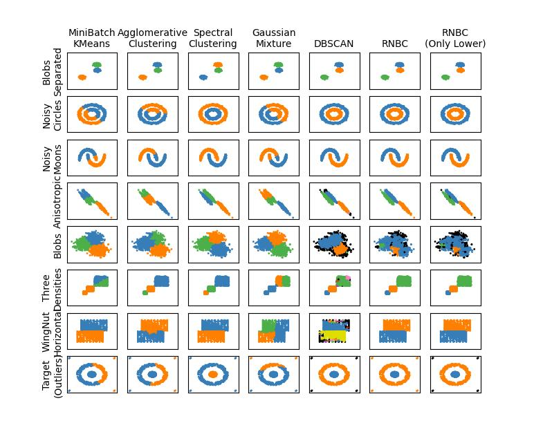

### Source codes for paper:

# Rough neighborhood graph: a method for proximity modeling and data clustering 

Authors: [Tomasz Hachaj](https://home.agh.edu.pl/~thachaj/),
[Jarosław Wąs](https://home.agh.edu.pl/~jarek/)

In this paper, we will introduce the novel concept of a rough neighborhood graph as a method for proximity modeling and data clustering. Contrary to previous research in the field of application of rough sets in graph theory, we decided to use an undirected graph, which will be a convenient structure to perform community discovery algorithms. Also, the approach proposed in this paper is closer to spectral clustering from the perspective of dataset representation. Our approach is also not a variation of rough fuzzy KMenas. The clusters detected by our method do not have to be concentric, and we do not need to define a specific number of clusters we want to discover. We also use a rough set-inspired framework to represent proximity relations between object pairs in the dataset. Our definition of neighborhood is distance-based, not approximation-based. Due to this fact, we are able to process any dataset in which objects are in metric space (there is a defined metric that allows pairwise comparison). We have validated our approach on various benchmark datasets, achieving nearly perfect clustering results that overcome the limitations of other popular algorithms. All required data and source codes for the proposed method can be downloaded from an online repository, and the results presented in this paper can be reproduced.

Keywords: Rough sets, Clustering, Neighborhood approximation, Neighborhood graph

## Requirements

- Python >= 3.8
- scikit-learn >= 1.22
- numpy >= 1.24

## How to run

Run script [run.py](run.py), it will compare RNBC 
with other popular clustering algorithms on benchmark datasets.

Additionally, you can run script [find_parameters.py](find_parameters.py) 
in order to evaluate DBSCAN, RNBC and RNBC (Only Lower) with large range 
of configuration parameters 
on selected benchmark datasets.

## Full text

[https://www.sciencedirect.com/science/article/pii/S1568494625001000](https://www.sciencedirect.com/science/article/pii/S1568494625001000)

## Cite as

Tomasz Hachaj, Jarosław Wąs, Rough neighborhood graph: A method for proximity modeling and data clustering, Applied Soft Computing, Volume 171, 2025, 112789, ISSN 1568-4946, https://doi.org/10.1016/j.asoc.2025.112789

Bibtex:

@article{HACHAJ2025112789,\
title = {Rough neighborhood graph: A method for proximity modeling and data clustering},\
journal = {Applied Soft Computing},\
volume = {171},\
pages = {112789},\
year = {2025},\
issn = {1568-4946},\
doi = {https://doi.org/10.1016/j.asoc.2025.112789},\
url = {https://www.sciencedirect.com/science/article/pii/S1568494625001000},\
author = {Tomasz Hachaj and Jarosław Wąs}
}
